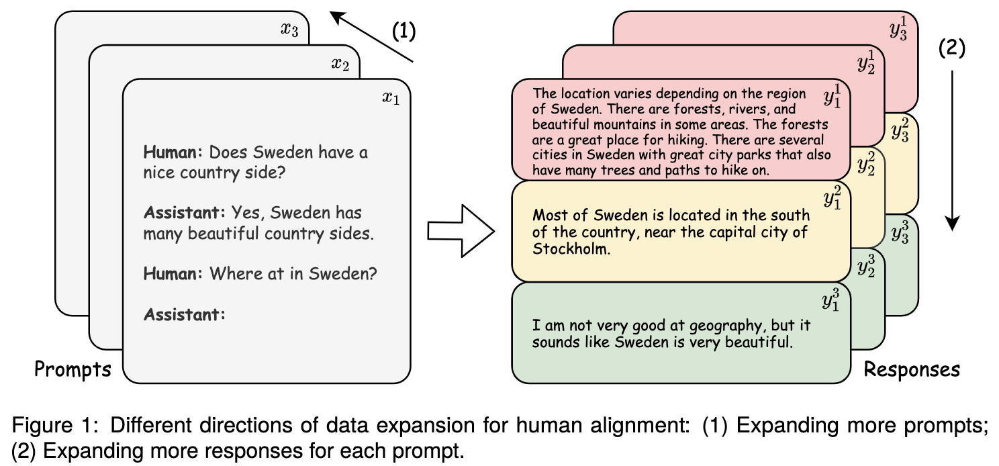
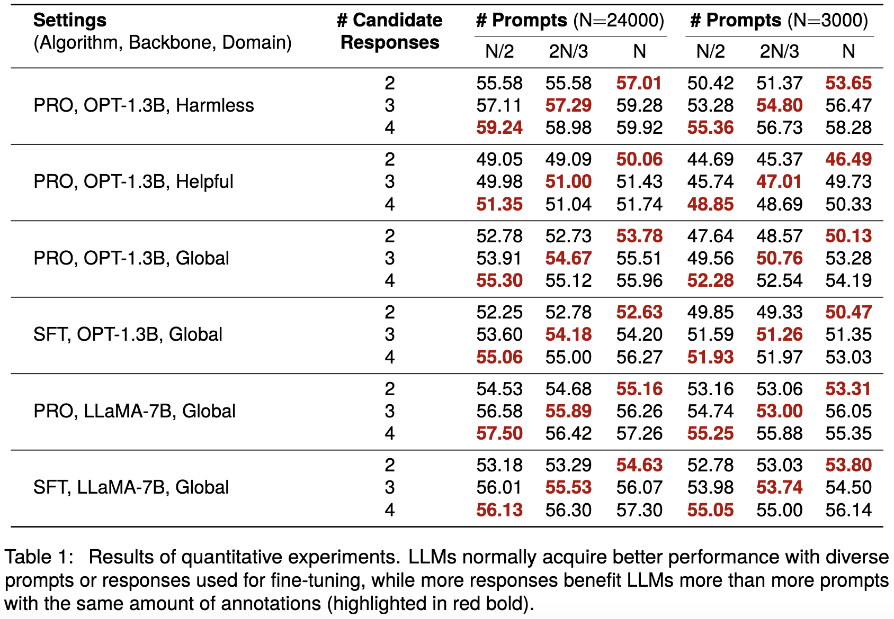
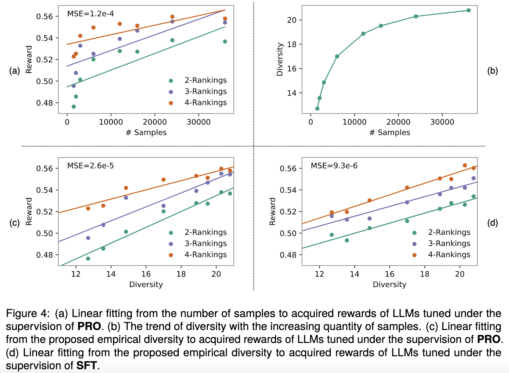

# Scaling Data Diversity for Fine-Tuning Language Models in Human Alignment
Authors: Feifan Song, Bowen Yu, Hao Lang, Haiyang Yu, Fei Huang, Houfeng Wang, Yongbin Li

arXiv: [Abstract](https://arxiv.org/abs/2403.11124) / [PDF](https://arxiv.org/pdf/2403.11124.pdf)



## Abstract
Alignment with human preference prevents large language models (LLMs) from generating misleading or toxic content while requiring high-cost human feedback. Assuming resources of human annotation are limited, there are two different ways of allocating considered: more diverse PROMPTS or more diverse RESPONSES to be labeled. Nonetheless, a straightforward comparison between their impact is absent. In this work, we first control the diversity of both sides according to the number of samples for fine-tuning, which can directly reflect their influence. We find that instead of numerous prompts, more responses but fewer prompts better trigger LLMs for human alignment. Additionally, the concept of diversity for prompts can be more complex than responses that are typically quantified by single digits. Consequently, a new formulation of prompt diversity is proposed, further implying a linear correlation with the final performance of LLMs after fine-tuning. We also leverage it on data augmentation and conduct experiments to show its effect on different algorithms. 

## Main Results



## Data Preparation
The data used in this paper is processed from [HH-RLHF](https://github.com/anthropics/hh-rlhf). 
Given the processed dataset that contains all original prompts and responses, you can execute the following commands to sample all subsets:

```
cd data_preprocess
# Get original datasets of ranking-2/3/4
python split.py
# Sample subsets of ranking-2/3/4
sh sample.sh
```
The processed dataset and all subsets are too large to be uploaded here. If you need them, feel free to contact [us](songff@stu.pku.edu.cn).

## Running
We prepare multiple scripts for easy fine-tuning. For example, you can run PRO algorithm on OPT-1.3b with the following commands:
```
cd training
sh train_hh_pro_1b3.sh [model_path] [exp_name] [data_path] [ranking_len] [seed]
```
The parameters are explained as follows:
- model_path: the path of the pre-trained model
- exp_name: a DIY name for the experiment
- data_path: the path of one subset
- ranking_len: the length of ranking, e.g., 2, 3 or 4
- seed: the random seed, e.g., 42, 43, 44

Other scripts are also provided (all required parameters can be found in them):
- train_hh_pro_7b.sh: run PRO algorithm on LLaMA-7b
- train_hh_sft_1b3.sh: run SFT on OPT-1.3b
- train_hh_sft_7b.sh: run SFT on LLaMA-7b

For evaluation, you can run the following commands:
```
cd eval_hh
sh eval.sh [exp_name] [ranking_len]
```

## ⚠️Caution
We acknowledge that the data involved in this work may indispensably contain sensitive, offensive, and misleading content, whose presence does not represent our attitudes, but is solely for research and should not be used or distributed outside of research contexts. We do not guarantee the safety of the generated content. Please use it at your own risk.

We are committed to establishing a more inclusive and ethically sound era of AI technology, which can be applied to legitimate needs and generate content that aligns with universally positive human values. 

## Citation
If this work is helpful to you, welcome to cite our paper as:
```
@misc{song2024scaling,
      title={Scaling Data Diversity for Fine-Tuning Language Models in Human Alignment}, 
      author={Feifan Song and Bowen Yu and Hao Lang and Haiyang Yu and Fei Huang and Houfeng Wang and Yongbin Li},
      year={2024},
      eprint={2403.11124},
      archivePrefix={arXiv},
      primaryClass={cs.CL}
}
```
